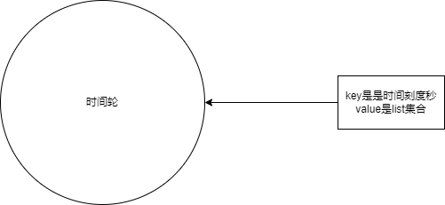

**上一章的最后，我指出了程序中存在的诸多问题，比如说，每次扫描数据库不查询所有定时任务信息，那要查询哪些定时任务信息呢？怎么保证查询的定时任务准时触发？如果数据库中没有定时任务信息了，或者定时任务信息比较少了，scheduleThread线程仍然要无限循环吗？这些遗留的问题将在本章得到解决，我的调度中心的核心功能也将在这一章实现。**

**现在我当然不希望每次都查询出数据库中的所有定时任务的信息了。那我具体该怎么办呢？经过短暂的思考，我忽然意识到，其实只要查询某一个时间段的定时任务信息就可以了。当然，查询的时间段肯定是以当前时间为起点的。比如说，我要查询10秒内可以执行的定时任务，肯定是以当前时间为起点，查询当前时间10秒后，这一时间段内可以执行的定时任务信息。如果当前时间是5秒，查询10秒内可以执行的，那查询的时间段肯定就是5——15秒，对吧？如果是这样的话，XxlJobInfoDao就应该定义一个新的方法了，就是根据执行时间来查询定时任务信息的方法，并且，由这个方法查询出来的定时任务都是可以执行的定时任务，这一点一定要梳理清楚。既然我们都已经是用时间来查询了，查询到的就是某个时间段内，所有可以执行的定时任务。请看下面的代码块。**

```java
@Mapper
public interface XxlJobInfoDao {

    //这个方法就是根据定时任务的名字，获得定时任务的具体信息
    XxlJobInfo loadByName(String name);

    //更新数据库中定时任务数据的方法
    int save(XxlJobInfo info);

    //从数据库中查询所有定时任务信息
    List<XxlJobInfo>  findAll();
  
	//根据执行时间查询定时任务信息的方法，这里查询的依据就是
    //定时任务下一次的执行时间。比如当前时间是0秒，要查询10秒以内的可以执行的定时任务
    //那么就判断定时任务下一次的执行时间只要是小于10秒的，都返回给用户
    //这些定时任务都是在10秒内可以执行的
    List<XxlJobInfo> scheduleJobQuery(long maxNextTime);
}
```

**好了，现在方法定义好了，那么下一个问题就来了。我该查询当前时间多久之内的定时任务信息呢？我以当前时间为起点，查询1秒之内的？还是5秒之内的？还是10秒，甚至是1分钟之内的？这就成了目前最棘手的问题了。请大家仔细思考思考，如果我一次从数据库中查询很少的任务，比如，我只查询当前时间到下1秒之内要执行的任务，这样每次查询出来的任务确实很少，并且时间的精度比较高，可以说是等任务真正该执行的时候我才去把它从数据库中查找出来。就比如说有一个任务要在1秒之后执行了，我才在1秒前把它从数据库中找出来然后判断是否应该执行了。这么做看似很好，但是，让我们换一种角度来思考，这么做对调度中心的性能来说无疑是一种拖累。每次只查询下一秒的定时任务，然后再去让线程池执行，但假如说，在查询这些任务，访问数据库，或者其他的方面线程阻塞了呢？每次只查询一秒然后判断，这么一来，可能后面紧接着的任务都会延后执行，似乎精度又没有那么准确了。再说，频繁地访问数据库，本身对性能就是一种拖累，显然我刚才的提议并不值得采纳。那这是不是就意味着一次查出来很多很多任务就是最好的呢？比如一次查询出10秒内要执行的定时任务，甚至一次查询出1分钟内要执行的定时任务，这样一来，查询出的任务势必会有很多。那会发生什么情况呢？先不说任务调度会不会拖累后续任务的远程调用，也不考虑scheduleThread线程和数据库打交道时的耗时很异常状况，就只考虑最实际的问题，如果一次取出1分钟以内要执行的定时任务，但是当前时间可能才是第1分钟，现在取出了1到2分钟之间要执行的定时任务，如果有定时任务是在1分1秒就要执行，那直接调度就行了，可是1分50秒要执行的任务该怎么办呢？scheduleThread线程可是不会休息的，难道没到时间的就再次跳过不理它，那把它查出来干嘛呀？脱裤子放屁呀！显然，这种决策也是行不通的。**

**并且，让我再来指出一点，现在scheduleThread扫描定时任务要和数据库打交道，这是个不确定的因素。而在真正的XXL-JOB源码中，一旦调度中心形成集群，就要防止定时任务被重复调度。这时候，就要使用分布式锁了，在XXL-JOB中，分布式锁是用数据库实现的，马上就会讲解到。所以，scheduleThread每次扫描定时任务之前，就要先和数据库打一次交道争抢分布式锁。如此看来，scheduleThread线程的性能本身就被这两点拖累了。**

## 时间轮精准触发任务

**但是，让我再来换一种思路，如果我只让scheduleThread线程负责从数据库中扫描出下一阶段可以执行的定时任务的信息，然后把这些定时任务信息缓存在一些数据结构中，然后让另一个线程到点之后就直接调度它们，也就是把这些定时任务按照时间顺序提交给线程池去真正的远程调度。这样的话，scheduleThread线程就只负责从数据库中扫描可以执行的定时任务，然后根据执行时间把它们缓存在某些容器中。而新的线程就根据这些定时任务的执行时间到点去调度这些定时任务。这样就做到了尽可能精确的触发定时任务了。讲到这里，大家应该也意识到了，我终于要为自己的程序引入时间轮了。但是在引入时间轮之前，还有一点需要最终确定，那就是究竟让scheduleThread线程扫描多少秒以内可以执行的定时任务信息呢？这里我就不卖关子了，源码中设定的是5秒，也就是查找出当前时间+5秒之内所有可以执行的定时任务信息，所以我就直接按照5秒来重构自己的调度中心了。**

**接下来，就请大家看看我重构之后的JobScheduleHelper类。**

```java
public class JobScheduleHelper {

    //调度定时任务的线程
    private Thread scheduleThread;

    //这个就是时间轮线程
    //这个时间轮线程就是用来主要向触发器线程池提交触发任务的
    //它提交的任务是从Map中获得的，而Map中的任务是由上面的调度线程添加的，具体逻辑会在下面的代码中讲解
    private Thread ringThread;

    //这个就是时间轮的容器，该容器中的数据是由scheduleThread线程添加的
    //但是移除是由ringThread线程移除的
    //Map的key为时间轮中任务的执行时间，也就是在时间轮中的刻度，value是需要执行的定时任务的集合，这个集合中的数据就是需要执行的定时任务的id
    //意思就是在这个时间，有这么多定时任务要被提交给调度线程池
    private volatile static Map<Integer, List<Integer>> ringData = new ConcurrentHashMap<>();
  
    //创建当前类的对象
    private static JobScheduleHelper instance = new JobScheduleHelper();

    //把当前类的对象暴露出去
    public static JobScheduleHelper getInstance(){
        return instance;
    }

    //这里定义了5000毫秒，查询数据库的时候会用到，查询的就是当前时间5秒之内的可以执行的
    //定时任务信息
    public static final long PRE_READ_MS = 5000;

    //启动调度线程工作的方法
    public void start(){
    
      scheduleThread = new Thread(new Runnable() {
            @Override
            public void run() {
                 while (true) {
                     //得到当前时间
            		 long nowTime = System.currentTimeMillis();
                     //从数据库中根据执行时间查询定时任务的方法
            		 List<XxlJobInfo> jobInfoList = scheduleJobQuery(nowTime + PRE_READ_MS);
            		 //遍历所有定时任务信息
                     for (XxlJobInfo jobInfo : jobInfoList) {
                         //注意，这里的判断条件改成了小于等于了，别忘了，我已经从
                         //数据库中查出来所有的5秒内可执行的定时任务了，这些任务都是可以执行的
                         //如果当前时间小于定时任务的下一次执行时间，说明还没有到定时任务的执行时间呢
                         //下面我就要把计算定时任务在时间轮中的精确执行时间，把定时任务放到时间轮中了
                         if (nowTime <= jobInfo.getTriggerNextTime) {
                             //接下来就把5秒内可以执行，但是还不到执行时间的定时任务放到时间轮中
                             //计算该任务要放在时间轮的刻度，也就是在时间轮中的执行时间，注意哦，千万不要被这里的取余给搞迷惑了
                             //这里的余数计算结果为0-59，单位是秒，意味着时间轮有60个刻度，一个代表一秒。
                             //所以，这里就计算出来该定时任务在时间轮中的哪个刻度
                             int ringSecond = (int)((jobInfo.getTriggerNextTime()/1000)%60);
                             //把定时任务的信息，就是它的id放进时间轮
                             pushTimeRing(ringSecond, jobInfo.getId());
                    		 //计算定时任务下一次的执行时间，这里就不再使用当前时间为计算标志了，使用的是定时任务这一次的执行时间为计算标志
                             //比如说定时任务是在第1秒执行了，如果每2秒执行一次，那下一次的计算时间肯定是在第1秒之后，所以用第1秒这个时间为计算标志
                    		 Date nextTime = new CronExpression(scheduleCron).getNextValidTimeAfter(new Date(jobInfo.getTriggerNextTime()));
                    		 //下面就是更新数据库中定时任务的操作
                    		 XxlJobInfo job = new XxlJobInfo();
                    		 job.setExecutorHandler(selfishHeart);
                    		 job.setTriggerNextTime(nextTime.getTime());
                    		 save(job);
                         }
                     }
                 }
            }
        });  
      //启动调度线程
      scheduleThread.start();


     //在这里创建时间轮线程，并且启动
     ringThread = new Thread(new Runnable() {
            @Override
            public void run() {
                while (!ringThreadToStop) {
                    try {
                        //这里让线程睡一会，作用还是比较明确的，因为该线程是时间轮线程，时间轮执行任务是按照时间刻度来执行的
                        //如果这一秒内的所有任务都调度完了，但是耗时只用了500毫秒，剩下的500毫秒就只好睡过去，等待下一个整秒到来
                        //再继续开始工作。System.currentTimeMillis() % 1000计算出来的结果如果是500毫秒，1000-500=500
                        //线程就继续睡500毫秒，如果System.currentTimeMillis() % 1000计算出来的是0，说明现在是整秒，那就睡1秒，等到下个
                        //工作时间再开始工作
                        TimeUnit.MILLISECONDS.sleep(1000 - System.currentTimeMillis() % 1000);
                    } catch (InterruptedException e) {
                        if (!ringThreadToStop) {
                            logger.error(e.getMessage(), e);
                        }
                    }
                    try {
                        //先定义一个集合变量，刚才已经强调过了，时间轮是一个Map容器，Map的key是定时任务要执行的时间，value是定时任务的JobID的集合
                        //到了固定的时间，要把对应时刻的定时任务从集合中取出来，所以自然也要用集合来存放这些定时任务的ID
                        List<Integer> ringItemData = new ArrayList<>();
                        //获取当前时间的秒数
                        int nowSecond = Calendar.getInstance().get(Calendar.SECOND);
                        //下面这里很有意思，如果我们计算出来的是第3秒，时间轮线程会把第2秒，和第3秒的定时任务都取出来，一起执行
                        //这里肯定会让大家感到困惑，时间轮不是按照刻度走的吗？如果走到3秒的刻度，说明2秒的任务已经执行完了，为什么还要再拿出来？
                        //这是因为考虑到定时任务的调度情况了，如果时间轮某个刻度对应的定时任务太多，本来该最多1秒就调度完的，结果调度了2秒，直接把下一个刻度跳过了
                        //这样不就出错了？所以，每次执行的时候要把前一秒的也取出来，检查一下看是否有任务，这也算是一个兜底的方法
                        for (int i = 0; i < 2; i++) {
                            //循环了两次，第一次取出当前刻度的任务，第二次取出前一刻度的任务
                            //注意，这里取出的时候，定时任务就从时间轮中被删除了
                            List<Integer> tmpData = ringData.remove( (nowSecond+60-i)%60 );
                            if (tmpData != null) {
                                //把定时任务的ID数据添加到上面定义的集合中
                                ringItemData.addAll(tmpData);
                            }
                        }
                        logger.debug(">>>>>>>>>>> xxl-job, time-ring beat : " + nowSecond + " = " + Arrays.asList(ringItemData) );
                        //判空操作
                        if (ringItemData.size() > 0) {
                            for (int jobId: ringItemData) {
                                //在for循环中处理定时任务，让触发器线程池开始远程调用这些任务
                                JobTriggerPoolHelper.trigger(jobInfo);
                            }
                            //最后清空集合
                            ringItemData.clear();
                        }
                    } catch (Exception e) {
                        if (!ringThreadToStop) {
                            logger.error(">>>>>>>>>>> xxl-job, JobScheduleHelper#ringThread error:{}", e);
                        }
                    }
                }
            }
        });
        ringThread.start();
    }

	//把定时任务放到时间轮中
    private void pushTimeRing(int ringSecond, int jobId){
        List<Integer> ringItemData = ringData.get(ringSecond);
        if (ringItemData == null) {
            ringItemData = new ArrayList<Integer>();
            ringData.put(ringSecond, ringItemData);
        }
        ringItemData.add(jobId);
    }

  
}
```

**在上面的代码块中，我就把调度中心的JobScheduleHelper组件又一次重构完善了。并且代码的逻辑在注释中非常详细，我相信不用我再特意去讲解了吧。如果大家能跟得上之前文章讲解的思路，这里再加上详细的代码注释，理清楚代码的逻辑应该一点问题也没有。在上面的代码块中其实只有一个知识点需要再次重复一下，就是时间轮的内部构造。在xxl-job的时间轮中，其内部存储数据的容器是一个Map，如果学习了我之前手写Netty，会发现Netty中的时间轮存储数据的容器是一个数组。其实这些容器是什么数据结构都没关系，只要这些存储数据的容器能体现出定时任务的优先级顺序即可。请看下面一幅简图。**




## 任务容错处理

**看起来，我的程序也终于重构完了，只要我把程序重新部署，我就可以高枕无忧了，每天等着数钱钱就行。但是，没想到我部署程序没两天，程序就出错了。定时任务不是没有执行，就是少执行了，这怎么行呢？一次不执行就会让我的小金库损失一两百块钱！可是问题出在哪里了呢？我只好去数据库中看了看，然后看了看调度中心服务器。然后找到了问题出现的原因。原来是我把服务器想得太完美了，忽略了它自身可能存在的问题。**

**请大家想一想，服务器也只是台机器，就算你购买的是名声最好的云服务器，可能也会有出问题的时候，比如说你服务器中要调度的定时任务太多，服务器资源不足，或者服务器用着用着突然崩溃宕机了，这样一来，任务就无法调度了。并且，当服务器重启之后，应该调度的任务的执行时间已经错过了，这样一来，本次该调度的定时任务就无法再被调度了。**

**分析得具体一点，就拿我目前的调度中心举例吧。现在我的scheduleThread线程从数据库中扫描定时任务信息，每次循环都会扫描当前时间+5秒内的，假如当前时间是第0秒，扫描出了0——5秒之内所有要执行的定时任务信息。有一个定时任务本来要在第2秒要被调度，可是调度中心服务器在第1秒宕机了，重启之后已经是第10秒了，这样一来，要调度的那个定时任务已经不在本次的5秒内的调度周期中了(因为每次扫描5秒内的任务，所以可以把调度的周期当作5秒)，这时候要怎么处理这个定时任务呢？**

**再比如，如果要调度的定时任务在第2秒，服务器在第1秒宕机了，但是服务器在第3秒重启成功了，这时候，错过的定时任务仍然在我的5秒调度周期内，这时候又该怎么办呢？接着再考虑另一种情况，如果我的定时任务是1秒执行一次，在第1秒调度了一次后，第2秒是不是又要调度一次？这时候，按照我目前的每次只扫描5秒以内的定时任务信息的方式，这种情况又该怎么办呢？还有最重要的一点，每次只扫描5秒以内的定时任务信息，这个5秒具体是怎么定义的？难道是扫描完了0——5秒的，就开始扫描6——10秒吗？最后，如果不得不考虑服务器资源问题，为了缓解服务器的压力，是不是有必要可以让scheduleThread线程偶尔休息一下呢？比如，数据库中没多少数据的时候，就不要一直循环了，这样可以吗？问题我都已经列出来了，下面，请大家带着这几个问题，仔细地从下面为大家呈现的代码块中寻找答案吧。**

```java
public class JobScheduleHelper {

    //调度定时任务的线程
    private Thread scheduleThread;

    //这个就是时间轮线程
    //这个时间轮线程就是用来主要向触发器线程池提交触发任务的
    //它提交的任务是从Map中获得的，而Map中的任务是由上面的调度线程添加的，具体逻辑会在下面的代码中讲解
    private Thread ringThread;

    //这个就是时间轮的容器，该容器中的数据是由scheduleThread线程添加的
    //但是移除是由ringThread线程移除的
    //Map的key为时间轮中任务的执行时间，也就是在时间轮中的刻度，value是需要执行的定时任务的集合，这个集合中的数据就是需要执行的定时任务的id
    //意思就是在这个时间，有这么多定时任务要被提交给调度线程池
    private volatile static Map<Integer, List<Integer>> ringData = new ConcurrentHashMap<>();
  
    //创建当前类的对象
    private static JobScheduleHelper instance = new JobScheduleHelper();

    //把当前类的对象暴露出去
    public static JobScheduleHelper getInstance(){
        return instance;
    }

    //这里定义了5000毫秒，查询数据库的时候会用到，查询的就是当前时间5秒之内的可以执行的
    //定时任务信息
    public static final long PRE_READ_MS = 5000;

    //启动调度线程工作的方法
    public void start(){
    
      scheduleThread = new Thread(new Runnable() {
            @Override
            public void run() {
                 while (true) {
                     //这个变量下面要用到，就是用来判断是否从数据库中读取到了数据，读取到了就意味着有任务要执行
                     //这里默认为true
                     boolean preReadSuc = true;
                     //得到当前时间
            		 long nowTime = System.currentTimeMillis();
                     //从数据库中根据执行时间查询定时任务的方法
            		 List<XxlJobInfo> jobInfoList = scheduleJobQuery(nowTime + PRE_READ_MS);
                     //判空操作
                     if (jobInfoList!=null && jobInfoList.size()>0) {
            		 //遍历所有定时任务信息
                     for (XxlJobInfo jobInfo : jobInfoList) {
                         //这里做了一个判断，刚才得到的当前时间，是不是大于任务的下一次执行时间加上5秒，为什么会出现这种情况呢？
                         //让我们仔细想一想，本来，一个任务被调度执行了，就会计算出它下一次的执行时机，然后更新数据库中的任务的下一次执行时间
                         //但请大家思考另外一种情况，如果服务器宕机了呢？本来上一次要执行的任务，却没有执行，比如这个任务要在第5秒执行，但是服务器在第4秒宕机了
                         //重新恢复运行后，已经是第12秒了，现在去数据库中查询任务，12 > 5 + 5，就是if括号中的不等式，这样一来，是不是就查到了执行时间比当前时间还小的任务
                         //并且已经超过当前的5秒调度周期了
                         if (nowTime > jobInfo.getTriggerNextTime() + PRE_READ_MS) {
                             //既然有过期的任务，在这里立刻调度一次任务
                             JobTriggerPoolHelper.trigger(jobInfo);
                             //在这里把过期任务的下次执行时间刷新一下，放到下一次来执行，因为定时任务已经严重过期了，所以计算一下次的执行时间
                             //就应该以当前时间为标志了
                             refreshNextValidTime(jobInfo, new Date());
                         }
                         //这里得到的就是要执行的任务的下一次执行时间同样也小于了当前时间，但是这里和上面的不同是，没有超过当前时间加5秒的那个时间
                         //现在大家应该都清楚了，上面加的那个5秒实际上就是调度周期，每一次处理的任务都是当前任务加5秒这个时间段内的
                         //这一次得到的任务仅仅是小于当前时间，但是并没有加上5秒，说明这个任务虽然过期了但仍然是在当前的调度周期中
                         //比如说这个任务要在第2秒执行，但是服务器在第1秒宕机了，恢复之后已经是第4秒了，现在任务的执行时间小于了当前时间，但是仍然在5秒的调度器内
                         //所以调度执行即可
                         else if (nowTime > jobInfo.getTriggerNextTime()) {
                             //把任务交给触发器去远程调用
                             JobTriggerPoolHelper.trigger(jobInfo);
                             //刷新该任务下一次的执行时间，也是过期任务，所以也已当前时间为标准来计算下一次执行时间
                             refreshNextValidTime(jobInfo, new Date());
                             //下面这个分之中的任务就是比较正常的，但是又有些特殊的，
                             //判断这个任务的下一次执行时间是否小于这个执行周期，注意，上面的refreshNextValidTime方法已经把该任务的
                             //下一次执行时间更新了。如果更新后的时间仍然小于执行周期，说明这个任务会在执行周期中再执行一次，当然，也可能会执行多次，
                             //这时候，就不让调度线程来处理这个任务了，而是把它提交给时间轮，让时间轮去执行。
                             if (nowTime + PRE_READ_MS > jobInfo.getTriggerNextTime()) {
                                 //计算该任务要放在时间轮的刻度，也就是在时间轮中的执行时间，注意哦，千万不要被这里的取余给搞迷惑了
                                 //这里的余数计算结果为0-59，单位是秒，意味着时间轮有60个刻度，一个代表一秒。
                                 //调度线程是按调度周期来处理任务的，举个例子，调度线程从0秒开始启动，第5秒为一个周期，把这5秒要执行的任务交给时间轮了
                                 //就去处理下一个调度周期，千万不要把调度线程处理调度任务时不断增加的调度周期就是增长的时间，调度线程每次扫描数据库不会耗费那么多时间
                                 //这个时间是作者自己设定的，并且调度线程也不是真的只按整数5秒去调度任务
                                 //实际上，调度线程从0秒开始工作，扫描0-5秒的任务，调度这些任务耗费了1秒，再次循环时，调度线程就会从1秒开始，处理1-6秒的任务
                                 //虽说是1-6秒，但是1-5秒的任务都被处理过了，但是请大家想一想，有些任务也仅仅只是被执行了一次，如果有一个任务在0-5秒调度器内被执行了
                                 //但是该任务每1秒执行一次，从第1秒开始m，那它是不是会在调度期内执行多次？可是上一次循环它可能最多只被执行了两次，一次在调度线程内，一次在时间轮内
                                 //还有几次并未执行呢，所以要交给下一个周期去执行，但是这时候它的下次执行时间还在当前时间的5秒内，如果下个周期直接从6秒开始
                                 //这个任务就无法执行了，大家可以仔细想想这个过程
                                 //时间轮才是真正按照时间增长的速度去处理定时任务的
                                 int ringSecond = (int)((jobInfo.getTriggerNextTime()/1000)%60);
                                 //把定时任务的信息，就是它的id放进时间轮
                                 pushTimeRing(ringSecond, jobInfo.getId());
                                 //刷新定时任务的下一次的执行时间，注意，这里传进去的就不再是当前时间了，而是定时任务现在的下一次执行时间
                                 //因为放到时间轮中就意味着它要执行了，所以计算新的执行时间就行了
                                 refreshNextValidTime(jobInfo, new Date(jobInfo.getTriggerNextTime()));
                             }
                         }
                         //最后，这里得到的就是最正常的任务，也就是执行时间在当前时间之后，但是又小于执行周期的任务
                         //上面的几个判断，都是当前时间大于任务的下次执行时间，实际上都是在过期的任务中做判断
                         else {
                              //这样的任务就很好处理了，反正都是调度周期，也就是当前时间5秒内要执行的任务，所以直接放到时间轮中就行
                              //计算出定时任务在时间轮中的刻度，其实就是定时任务执行的时间对应的秒数
                              //随着时间流逝，时间轮也是根据当前时间秒数来获取要执行的任务的，所以这样就可以对应上了
                              int ringSecond = (int)((jobInfo.getTriggerNextTime()/1000)%60);
                              //放进时间轮中
                              pushTimeRing(ringSecond, jobInfo.getId());
                              //刷新定时任务下一次的执行时间
                              refreshNextValidTime(jobInfo, new Date(jobInfo.getTriggerNextTime()));

                         }
                     }
                     //最后再更一下所有的任务的数据库信息
                     for (XxlJobInfo jobInfo: jobInfoList) {
                          save((jobInfo);
                     }
                }
                 else {
                     //走到这里，说明根本就没有从数据库中扫描到任何任务，把preReadSuc设置为false
                     preReadSuc = false;
                 }

                 //再次得到当然时间，然后减去开始执行扫面数据库任务的开始时间
                 //就得到了执行扫面数据库，并且调度任务的总耗时
                 long cost = System.currentTimeMillis()-start;
                 //这里有一个判断，1000毫秒就是1秒，如果总耗时小于1秒，就默认数据库中可能没多少数据
                 //线程就不必工作得那么繁忙，所以下面要让线程休息一会，然后再继续工作
                 if (cost < 1000) {
                     try {
                         //下面有一个三元运算，判断preReadSuc是否为true，如果扫描到数据了，就让该线程小睡一会儿，最多睡1秒
                         //如果根本就没有数据，就说明5秒的调度器内没有任何任务可以执行，那就让线程最多睡5秒，把时间睡过去，过5秒再开始工作
                         TimeUnit.MILLISECONDS.sleep((preReadSuc?1000:PRE_READ_MS) - System.currentTimeMillis()%1000);
                     } catch (InterruptedException e) {
                             logger.error(e.getMessage(), e);   
                        }
                    }  
               }
            }
        });  
      //启动调度线程
      scheduleThread.start();


     //在这里创建时间轮线程，并且启动
     ringThread = new Thread(new Runnable() {
            @Override
            public void run() {
                while (!ringThreadToStop) {
                    try {
                        //这里让线程睡一会，作用还是比较明确的，因为该线程是时间轮线程，时间轮执行任务是按照时间刻度来执行的
                        //如果这一秒内的所有任务都调度完了，但是耗时只用了500毫秒，剩下的500毫秒就只好睡过去，等待下一个整秒到来
                        //再继续开始工作。System.currentTimeMillis() % 1000计算出来的结果如果是500毫秒，1000-500=500
                        //线程就继续睡500毫秒，如果System.currentTimeMillis() % 1000计算出来的是0，说明现在是整秒，那就睡1秒，等到下个
                        //工作时间再开始工作
                        TimeUnit.MILLISECONDS.sleep(1000 - System.currentTimeMillis() % 1000);
                    } catch (InterruptedException e) {
                        if (!ringThreadToStop) {
                            logger.error(e.getMessage(), e);
                        }
                    }
                    try {
                        //先定义一个集合变量，刚才已经强调过了，时间轮是一个Map容器，Map的key是定时任务要执行的时间，value是定时任务的JobID的集合
                        //到了固定的时间，要把对应时刻的定时任务从集合中取出来，所以自然也要用集合来存放这些定时任务的ID
                        List<Integer> ringItemData = new ArrayList<>();
                        //获取当前时间的秒数
                        int nowSecond = Calendar.getInstance().get(Calendar.SECOND);
                        //下面这里很有意思，如果我们计算出来的是第3秒，时间轮线程会把第2秒，和第3秒的定时任务都取出来，一起执行
                        //这里肯定会让大家感到困惑，时间轮不是按照刻度走的吗？如果走到3秒的刻度，说明2秒的任务已经执行完了，为什么还要再拿出来？
                        //这是因为考虑到定时任务的调度情况了，如果时间轮某个刻度对应的定时任务太多，本来该最多1秒就调度完的，结果调度了2秒，直接把下一个刻度跳过了
                        //这样不就出错了？所以，每次执行的时候要把前一秒的也取出来，检查一下看是否有任务，这也算是一个兜底的方法
                        for (int i = 0; i < 2; i++) {
                            //循环了两次，第一次取出当前刻度的任务，第二次取出前一刻度的任务
                            //注意，这里取出的时候，定时任务就从时间轮中被删除了
                            List<Integer> tmpData = ringData.remove( (nowSecond+60-i)%60 );
                            if (tmpData != null) {
                                //把定时任务的ID数据添加到上面定义的集合中
                                ringItemData.addAll(tmpData);
                            }
                        }
                        //判空操作
                        if (ringItemData.size() > 0) {
                            for (int jobId: ringItemData) {
                                //在for循环中处理定时任务，让触发器线程池开始远程调用这些任务
                                JobTriggerPoolHelper.trigger(jobInfo);
                            }
                            //最后清空集合
                            ringItemData.clear();
                        }
                    } catch (Exception e) {
                        logger.error(e.getMessage(), e);   
                    }
                }
            }
        });
        ringThread.start();
    }

	//把定时任务放到时间轮中
    private void pushTimeRing(int ringSecond, int jobId){
        List<Integer> ringItemData = ringData.get(ringSecond);
        if (ringItemData == null) {
            ringItemData = new ArrayList<Integer>();
            ringData.put(ringSecond, ringItemData);
        }
        ringItemData.add(jobId);
    }

    //计算定时任务下一次执行时间的方法
    private void refreshNextValidTime(XxlJobInfo jobInfo, Date fromTime) throws Exception {
        Date nextValidTime = generateNextValidTime(jobInfo, fromTime);
        if (nextValidTime != null) {
            jobInfo.setTriggerLastTime(jobInfo.getTriggerNextTime());
            jobInfo.setTriggerNextTime(nextValidTime.getTime());
        } else {
            jobInfo.setTriggerStatus(0);
            jobInfo.setTriggerLastTime(0);
            jobInfo.setTriggerNextTime(0);
            jobInfo.getId(), jobInfo.getScheduleType(), jobInfo.getScheduleConf());
        }
    }

    //利用cron表达式，计算定时任务下一次执行时间的方法
    public static Date generateNextValidTime(XxlJobInfo jobInfo, Date fromTime) throws Exception {
        Date nextValidTime = new CronExpression(jobInfo.getScheduleConf()).getNextValidTimeAfter(fromTime);
        return nextValidTime;
    }
  
}
```

**到此为止，从调度功能上来说，我的调度中心已经重构到尽善尽美的程度了，几乎所有该考虑的问题，我都考虑到了。**

**还有最后最后一个缺陷需要弥补，那就是在调度中心集群形态中，防止定时任务被重复调度。集群是当然要集群的，就像我不会把小金库只藏在一个地方。而在集群中，防止定时任务重复调度的方法很简单，就是加一个分布式锁。xxl-job中的分布式锁是用MySql实现的，下节课见**
